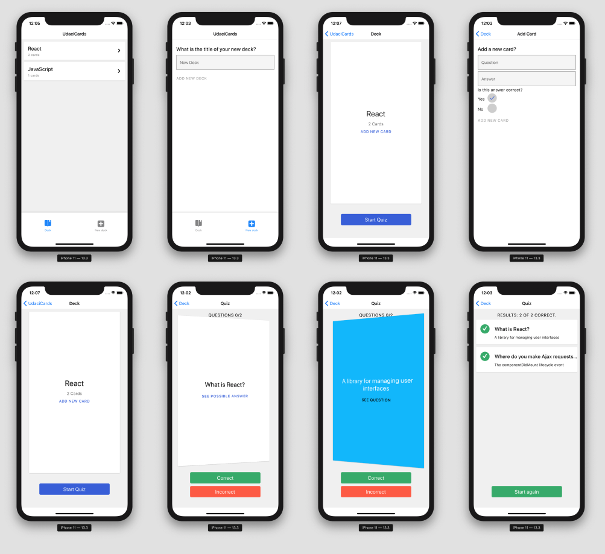

# UdaciCards

This is mobile application for Android and iOS that allows users to study collections of flashcards. The app will allow users to create different categories of flashcards called "decks", add flashcards to those decks, then take quizzes on those decks.

This app was built with [Expo](https://docs.expo.io/get-started/create-a-new-app/).



### Simulators

To view this app you can use IOS and Android simulators:

- [IOS simulator](https://docs.expo.io/workflow/ios-simulator/)
- [Android studio emulator](https://docs.expo.io/workflow/android-studio-emulator/)

### Running the app

Install project dependencies 
```
yarn install
```

Run local environment 
```
yarn start
// or 
expo start
```

Expo CLI starts Metro Bundler, which is an HTTP server that compiles the JavaScript code of our app using Babel and serves it to the Expo app. It also pops up Expo Dev Tools, a graphical interface for Expo CLI.

```
Press "a" for Android emulator, or "i" for iOS simulator
// Or use the graphical interface to run the project on a simulator
```

Run tests (see notes below for test coverage)
```
yarn test
```

## Notes:

### Simulators
I had difficulty starting and running a [create react native app](https://github.com/expo/create-react-native-app) togeather with simulators. I started using [Expo snack](https://snack.expo.io/) and that led me to [create new app](https://docs.expo.io/get-started/create-a-new-app/) with expo cli. I found consistency and confidence with this framework.

- App was run on both IOS (iphone 11) and Android (Pixel_2_API_30) simulators.
- App was run on actual IOS device via expo app 

### About the app

- Foundation: Expo ([create new app](https://docs.expo.io/get-started/create-a-new-app/)) and react native
- Navigation: react-navigation (Tabs and Stack)
- Data management: Async storage and Redux have been used to handle data management and storage
- Styling: a mixture of react native StyleSheet and `react-native-paper` components.
- Notifications: tested on actual IOS device via the expo app and seemed to work, but did not work via simulators (this seems to be documented [here](https://docs.expo.io/versions/latest/sdk/notifications/)).
- Local state: has been used on the create new deck and create new card pages. It has also been used on the quiz page as I am not collecting/storing any data via completing the quiz and answers correct and incorrect so local state was used instead of a redux action.
- Tests: only tests for calls to async storage via jest and [async storage mock](https://react-native-community.github.io/async-storage/docs/advanced/jest)